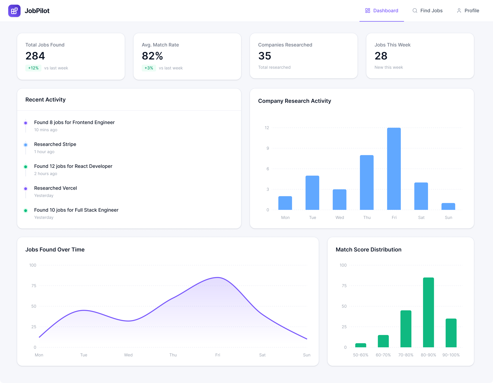
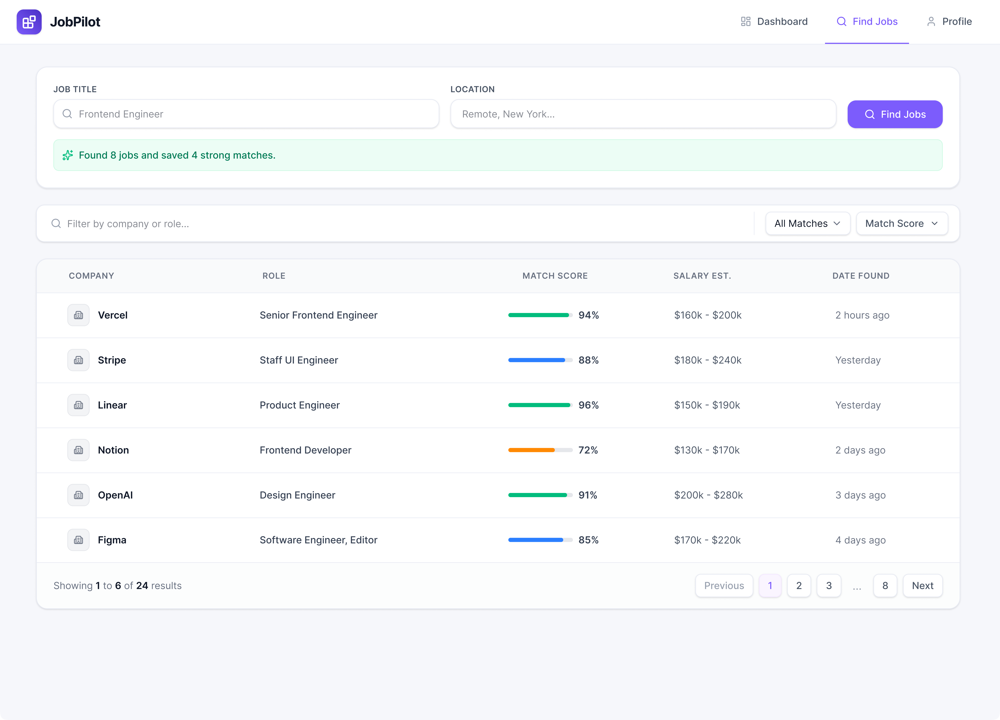
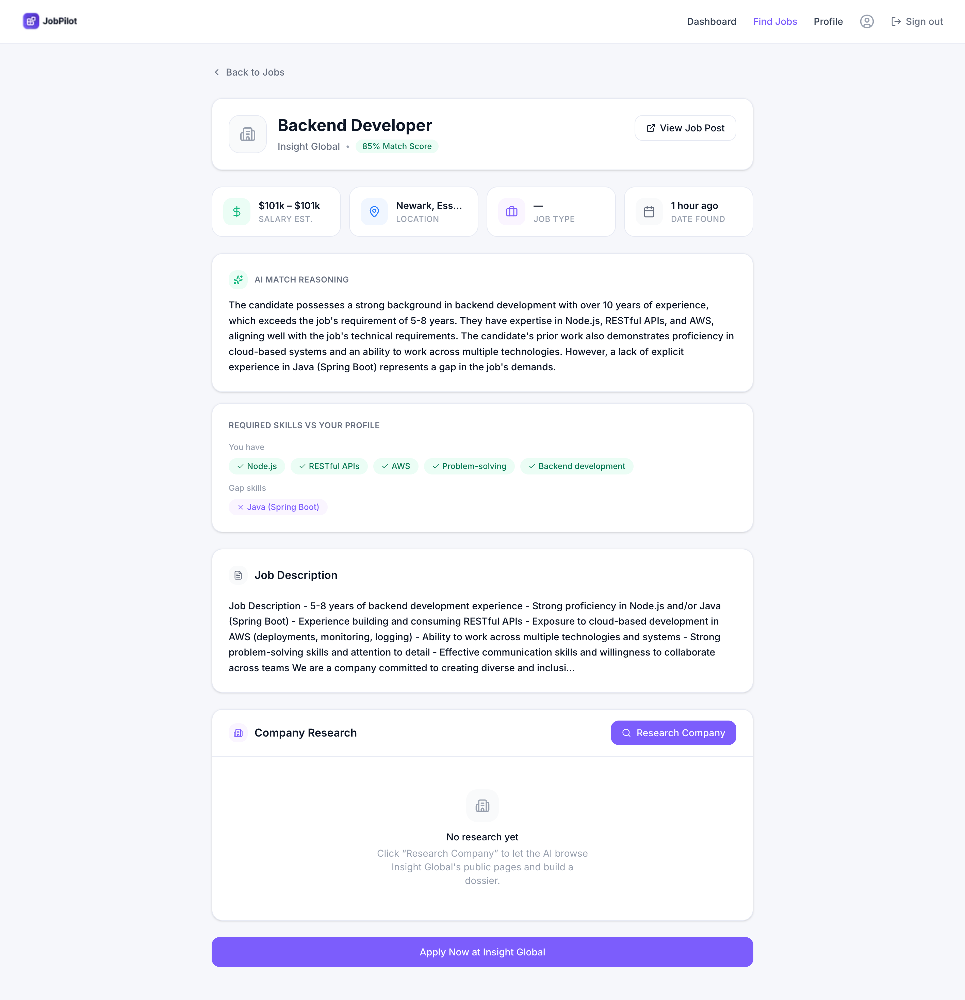

<div align="center">


# JobPilot

### AI-Powered Job Hunting Assistant

Find relevant jobs, get intelligent match scores, research companies, and prepare — all powered by AI.


</div>

---

## Table of Contents

- [Features](#features)
- [Screenshots](#screenshots)
- [Tech Stack](#tech-stack)
- [Getting Started](#getting-started)
- [Environment Variables](#environment-variables)
- [Scripts](#scripts)
- [Project Structure](#project-structure)
- [How It Works](#how-it-works)
- [Notes & Limitations](#notes--limitations)
- [License](#license)

---

## Features

- **AI profile extraction** — upload a PDF resume and Gemini auto-fills your profile.
- **Resume generation** — generate a clean, polished PDF resume from your profile.
- **Live job discovery** — search real jobs (title · company · location) via JSearch.
- **AI match scoring** — every job is scored 0–100 against your profile, with a match reason and matched/missing skills.
- **Filter · sort · pagination** — high/low match filters, sort by score or date, search by company or role.
- **Company research agent** — reads the employer's public site and generates a 9-field dossier (overview, tech stack, culture, your edge, gaps to address, smart interview questions, prep, sources).
- **Dashboard** — real stats, a recent-activity timeline, and analytics charts (jobs over time, match-score distribution, research activity).
- **Dark / light theme** — dark by default, with a Bright/Dark switch on the landing page (persisted).

---

## Screenshots

> Reference designs the app is built to match (`context/designs/`).

|                          Landing                          |                        Dashboard                        |
| :-------------------------------------------------------: | :-----------------------------------------------------: |
|  |   |

|                       Find Jobs                        |                         Job Details                         |
| :----------------------------------------------------: | :---------------------------------------------------------: |
|  |     |

---

## Tech Stack

| Layer               | Technology                                             |
| ------------------- | ------------------------------------------------------ |
| Framework           | Next.js `16.2.10` (App Router) · React `19.2.4` · TypeScript `5` |
| Styling             | Tailwind CSS `3.4` (pinned — do **not** upgrade to v4) · `autoprefixer` · CSS-variable design tokens |
| Backend (BaaS)      | [InsForge](https://insforge.dev) — auth, Postgres, storage (`@insforge/sdk`) |
| Auth                | InsForge OAuth (Google · GitHub)                       |
| AI                  | Google Gemini (`gemini-2.5-flash`, `@google/generative-ai`) |
| Job data            | JSearch via RapidAPI                                    |
| Company research    | Server-side fetch of the employer site + Gemini synthesis |
| Forms & validation  | `react-hook-form` · `@hookform/resolvers` · `zod`      |
| Icons               | `lucide-react`                                          |
| PDF                 | `@react-pdf/renderer`                                   |
| Analytics           | PostHog (`posthog-js`)                                  |
| Charts              | Custom self-contained SVG (no chart library)           |
| Tooling             | ESLint (`eslint-config-next`) · Turbopack dev server   |

> **Full dependency list** is in `package.json`. Runtime: `next`, `react`, `react-dom`,
> `@insforge/sdk`, `@google/generative-ai`, `@react-pdf/renderer`, `react-hook-form`,
> `@hookform/resolvers`, `zod`, `lucide-react`, `posthog-js`, `autoprefixer`. Dev:
> `typescript`, `eslint`, `eslint-config-next`, `tailwindcss`, `@types/*`.

---

## Getting Started

### Prerequisites

- **Node.js 20+** (developed on Node 24)
- An [InsForge](https://insforge.dev) project (URL + anon key)
- API keys: **Google Gemini**, **RapidAPI (JSearch)**. PostHog is optional.

### Installation

```bash
# 1. Clone
git clone https://github.com/<your-username>/<your-repo>.git
cd <your-repo>

# 2. Install dependencies
npm install

# 3. Configure environment
cp .env.example .env.local
# then edit .env.local with your keys

# 4. Run the dev server
npm run dev
```

Open **http://localhost:3000**. Sign in, complete your profile (upload
`public/sample-resume.pdf` to try AI extraction), then run a job search.

> The InsForge backend needs these tables — `profiles`, `agent_runs`, `jobs`, `agent_logs` —
> and a private `resumes` storage bucket. See `context/architecture.md` for the full schema.

---

## Environment Variables

Copy `.env.example` → `.env.local` and fill in your values. `.env.local` is gitignored —
**never commit real secrets**.

| Variable                        | Required | Description                              |
| ------------------------------- | :------: | ---------------------------------------- |
| `NEXT_PUBLIC_INSFORGE_URL`      |    ✅    | InsForge backend URL                     |
| `NEXT_PUBLIC_INSFORGE_ANON_KEY` |    ✅    | InsForge anon/public key                 |
| `GEMINI_API_KEY`                |    ✅    | Google Gemini API key (all AI features)  |
| `RAPIDAPI_KEY`                  |    ✅    | RapidAPI key for JSearch                 |
| `NEXT_PUBLIC_POSTHOG_KEY`       |    ⚪    | PostHog ingest key (analytics)           |
| `NEXT_PUBLIC_POSTHOG_HOST`      |    ⚪    | PostHog host (e.g. `https://us.i.posthog.com`) |
| `BROWSERBASE_API_KEY`           |    ⚪    | Reserved — not currently used            |
| `BROWSERBASE_PROJECT_ID`        |    ⚪    | Reserved — not currently used            |

`NEXT_PUBLIC_*` vars are exposed to the browser; the rest are server-only.

---

## Scripts

| Command         | Description                          |
| --------------- | ------------------------------------ |
| `npm run dev`   | Start the dev server (Turbopack)     |
| `npm run build` | Production build                     |
| `npm run start` | Serve the production build           |
| `npm run lint`  | Run ESLint                           |

---

## Project Structure

```
app/
  page.tsx                     Landing page (+ theme toggle)
  layout.tsx                   Root layout, theme + PostHog providers
  login/ · auth/callback/      OAuth sign-in + callback
  dashboard/                   Stats, recent activity, analytics charts
  profile/                     Profile form, resume upload/generate
  find-jobs/                   Search + results list
  find-jobs/[id]/              Job details + company research
  api/agent/find/              Job discovery + Gemini scoring (route)
  api/agent/research/          Company research agent (route)
  actions/                     Server actions (AI extraction, resume)
agent/
  jsearch.ts                   JSearch discovery + batched Gemini scoring
  research.ts                  Company research (fetch + Gemini synthesis)
components/                    UI (ui/, layout/, homepage/, dashboard/, find-jobs/, …)
lib/
  insforge.ts                  InsForge browser client
  jsearch.ts                   JSearch API client
  utils/                       Shared helpers (dashboard metrics, profile completion)
context/                       Project docs (architecture, build-plan, ui-registry, designs)
proxy.ts                       Route protection (Next 16 middleware)
```

---

## How It Works

- **Job discovery** — the client calls `POST /api/agent/find` → `agent/jsearch.ts` queries
  JSearch, then Gemini scores every job against your profile in one batched call.
- **Company research** — `POST /api/agent/research` → `agent/research.ts` resolves the
  employer's homepage (follows the apply link, falls back to `www.<company>.com`), reads a
  few public pages, and Gemini synthesizes the dossier saved to `jobs.company_research`.
- **Dashboard** — stats, activity, and charts are computed client-side from the user's own
  `jobs` and `agent_runs` rows.
- **Theming** — the whole UI is driven by CSS-variable tokens; a `:root.dark` override
  re-themes every page, toggled via the landing-page switch and persisted in `localStorage`.

---

## Notes & Limitations

- **AI provider:** the app runs entirely on **Google Gemini** (not OpenAI). Some docs in
  `context/` reference GPT-4o aspirationally.
- **Job source:** **JSearch** (the project pivoted from Adzuna).
- **Dashboard charts** are DB-derived. `Total Jobs Found` reflects your current search set,
  since each new search replaces the previous results.
- **Deploy:** the codebase has pre-existing `@typescript-eslint/no-explicit-any` lint
  findings; `next build` fails on them by default. Set `eslint.ignoreDuringBuilds` in
  `next.config` (or clean them up) before deploying.

---

## License

Private / unlicensed — for demonstration and internal use.
